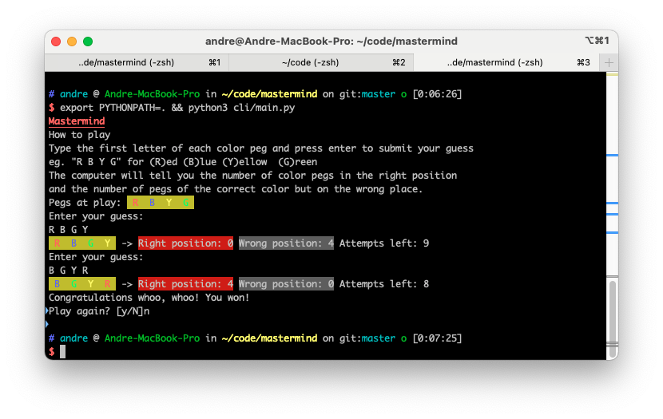

# Mastermind

## How to run

Run

`export PYTHONPATH=. python3 cli/main.py`

Example play

## How to run the tests

Install the development environment requirements

`pip install -r requirements_dev.txt`

Run tests with pytest

`pytest`

## Development dependencies used

pytest - testing framework

pytest-watch - automatically run the tests in TDD style

black - code formatter

flake8 - linter
